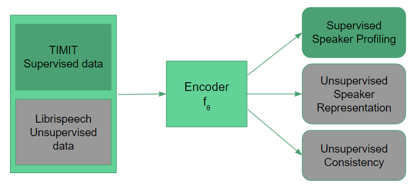

# Learning Speaker Representation with Semi-supervised Learning approach for Speaker Profiling



## Installation

Use the package manager [pip](https://pip.pypa.io/en/stable/) to install requirements.

```bash
pip install -r requirements.txt
```

## Usage
### Download the Dataset

```bash
# LibriSpeech Train-Clean-360(Unsupervised Learning Dataset)
wget https://www.openslr.org/resources/12/train-clean-360.tar.gz
tar -xvzf train-clean-360.tar.gz -C 'path to libri data folder'
```
```bash
# TIMIT(Supervised Learning Dataset)
wget wget https://data.deepai.org/timit.zip
unzip timit.zip -d 'path to timit data folder'
```

### Prepare Dataset for Training

```bash
# TIMIT Dataset
python TIMIT/prepare_data.py --path='path to timit data folder'
```
```bash
# LibriSpeech Dataset
python LibriSpeech/prepare_data.py --path='path to libri data folder'
```

### Update Config and logger

Update the config.py file to update the hyperparameters and path for dataset and select(comment/uncomment) the preferred Logger for training.

### Training (Dev mode)
```bash
# To make sure everything is in place for training
python train.py --dev=True
```

### Training 
```bash
# Training the model with the dataset/hyperparameters as given in config.py
python train.py 
```

### Testing 
```bash
# Test the model with the dataset/hyperparameters as given in config.py
# Optionally add model checkpoint in config.py file
python test.py --model_checkpoint='path to saved checkpoint'
```

## Results

### TIMIT Baseline
| Model                                  	| Height RMSE 	|        	| Height MAE 	|        	| Age RMSE 	|        	| Age MAE 	|        	| Gender Acc 	|
|----------------------------------------	|-------------	|--------	|------------	|--------	|----------	|--------	|---------	|--------	|------------	|
|                                        	| Male        	| Female 	| Male       	| Female 	| Male     	| Female 	| Male    	| Female 	|            	|
| Run 1                        	| 7.2         	| 6.4    	| 5.4        	| 5.0    	| 7.5      	| 7.8    	| 5.2     	| 5.2    	| 0.995      	|

### TIMIT Previous Results
|        Model        	|  Height 	|  RMSE  	|  Height 	|   MAE  	|  Age 	|  RMSE  	|  Age 	|   MAE  	| Gender Acc 	|
|:-------------------:	|:-------:	|:------:	|:-------:	|:------:	|:----:	|:------:	|:----:	|:------:	|:----------:	|
|                     	|   Male  	| Female 	|   Male  	| Female 	| Male 	| Female 	| Male 	| Female 	|            	|
|       [1] 2019      	|   6.85  	|  6.29  	|    -    	|    -   	|  7.6 	|  8.63  	|   -  	|    -   	|            	|
|  [2] 2016 (fusion)  	|   **6.7**   	|   6.1  	|  **5.0**   	|   5.0  	|  7.8 	|   8.9  	|  5.5 	|   6.5  	|            	|
| [2] 2016 (baseline) 	|   7.0   	|   6.5  	|   5.3   	|   5.2  	|  8.1 	|   9.1  	|  5.7 	|   6.2  	|            	|
|       [3] 2020      	|    -    	|    -   	|    -    	|    -   	| 7.24 	|  8.12  	| 5.12 	|  **5.29**  	|    **0.996**   	|
|       [4] 2009      	|   6.8   	|   6.3  	|   5.3   	|   5.1  	|   -  	|    -   	|   -  	|    -   	|            	|

## Contributing
Pull requests are welcome. For major changes, please open an issue first to discuss what you would like to change.

Please make sure to update tests as appropriate.

## License
[MIT](https://choosealicense.com/licenses/mit/)